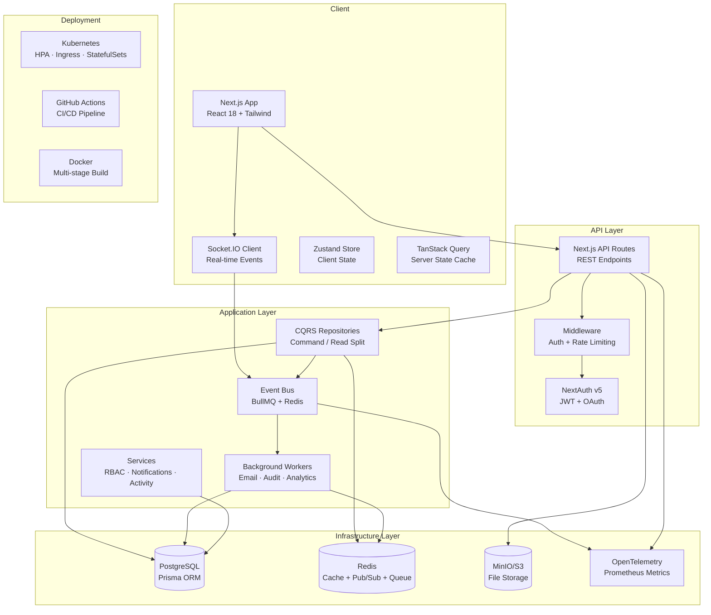

# TaskMesh

> Enterprise-grade real-time collaborative workspace for teams. Manage projects, track progress, and collaborate seamlessly.

[](https://github.com/yourusername/taskmesh/actions/workflows/ci.yml)
[](https://www.typescriptlang.org/)
[](https://nextjs.org/)
[](https://www.prisma.io/)
[](LICENSE)

---

## Quick Demo

```bash
# Clone & start in under 30 seconds
git clone <repo-url> && cd taskmesh
cp .env.example .env
docker compose up -d
npm run db:seed
npm run dev

# Open http://localhost:3000
# Login: demo@taskmesh.io / demo1234
```

---

## Architecture



---

## Architecture Decisions

### Why CQRS?
**Problem:** Read and write paths had different concerns. Reads need caching and fast projections; writes need validation, events, and consistency. Mixing them caused bloated repositories.

**Solution:** Split into `CommandRepository` (write — validates, publishes events, invalidates cache) and `ReadRepository` (read — cache-aside, specialized queries).

**Result:** Write operations are auditable and event-driven; reads are cached and fast. Each path can be optimized independently.

### Why Event-Driven Architecture?
**Problem:** Side effects (notifications, audit logs, email, analytics) ran synchronously in the request lifecycle, adding latency and failure risk.

**Solution:** 24 domain events published to BullMQ queues with Redis. Background workers handle side effects with retry, exponential backoff, and DLQ.

**Result:** Request latency dropped (side effects are async). Failed notifications retry automatically. New workers can be added without modifying existing code.

### Why Multi-Layer Cache?
**Problem:** Repeated Prisma queries (e.g., workspace members on every API call) hammered PostgreSQL. A single Redis layer added network round-trips for hot data.

**Solution:** L1 (in-memory Map, LRU eviction at 1000 entries) + L2 (Redis with TTL). Cache-aside with `getOrSet<T>()`.

**Result:** Hot data served from memory (~1μs). Cold misses populate Redis. Hit ratio tracked via Prometheus metrics.

### Why Feature Flags?
**Problem:** New features (AI, beta UI) couldn't be tested safely. Rollbacks required full deploys.

**Solution:** Redis-backed feature flags with rules: percentage rollout, user IDs, workspace IDs, plan tier. 8 flags covering AI, analytics, beta features.

**Result:** Gradual rollouts. Kill-switch without redeploy. Plan-based gating for monetization.

### Why Audit Logs with Hash Chaining?
**Problem:** Standard activity logs can be tampered with. Compliance requirements (SOC2, SOX) demand immutable trails.

**Solution:** SHA-256 hash chain where each entry includes the previous hash. `verifyIntegrity()` detects any tampering.

**Result:** Tamper-evident audit trail. Login history with IP/user-agent tracking. Session management with revocation.

---

## Features

### Product Features
| Feature | Description |
|---|---|
| **Auth** | Email/password, Google, GitHub OAuth — JWT sessions |
| **Workspaces** | Multi-tenant with slug URLs and role-based access |
| **Kanban Boards** | Drag-and-drop tasks, custom columns, priorities, labels, tags |
| **Real-time Collaboration** | Live presence, typing indicators, instant updates via Socket.IO |
| **Comments & Mentions** | Task-level threaded comments with @mention support |
| **Sprints** | Planning with goals, start/end dates, burndown tracking |
| **Subtasks** | Checklist with assignable items |
| **Notifications** | In-app center with 7 notification types |
| **Activity Logs** | 25+ action types with entity-level metadata |
| **User Profiles** | Bio, job title, department, timezone, avatar |
| **CSV Export** | Export tasks and activity logs |
| **Search** | Full-text search across all entities |
| **Global Search** | Cross-workspace search UI |

### Infrastructure Features
| Feature | Description |
|---|---|
| **Event-Driven Architecture** | 24 domain events, BullMQ queues, async workers with retry/DLQ |
| **Multi-Layer Caching** | L1 (memory) + L2 (Redis) cache-aside with targeted invalidation |
| **CQRS** | Separated command/read repositories with event publishing |
| **Rate Limiting** | Redis sliding window — per-endpoint configs, brute-force protection |
| **S3 File Storage** | Presigned URL uploads/downloads via MinIO/S3 |
| **CI/CD** | GitHub Actions — lint, test, build, E2E, security, deploy |
| **Kubernetes** | Manifests — Deployment, HPA, PDB, Ingress, StatefulSets, PVCs |
| **Observability** | Pino logging, Prometheus metrics (11 metric types), health endpoint |
| **Immutability** | SHA-256 chained audit logs, session tracking, login history |
| **Feature Flags** | Redis-backed with percentage/user/plan rule engine |
| **AI Assistant** | OpenAI GPT-4o-mini for task/sprint/story generation |
| **Search** | PostgreSQL full-text search across 5 entity types with ranking |

---

## Tech Stack

| Category | Technology |
|---|---|
| **Frontend** | Next.js 14 (App Router), React 18, TypeScript, Tailwind CSS |
| **State** | Zustand (client), TanStack Query (server) |
| **UI** | Radix UI, Lucide icons, Recharts, dnd-kit |
| **Forms** | React Hook Form + Zod |
| **Database** | PostgreSQL + Prisma ORM |
| **Cache/Queue** | Redis (ioredis) + BullMQ |
| **Real-time** | Socket.IO |
| **Auth** | NextAuth v5 (Credentials, Google, GitHub) |
| **Storage** | AWS S3 SDK / MinIO (presigned URLs) |
| **AI** | OpenAI API (GPT-4o-mini) |
| **Observability** | Pino + Prometheus |
| **Testing** | Vitest + Playwright |
| **CI/CD** | GitHub Actions |
| **Containers** | Docker + Docker Compose |
| **Orchestration** | Kubernetes (minikube or cloud) |

---

## Project Structure

```
taskmesh/
├── app/                         # Next.js App Router
│   ├── (auth)/                  # Login, Register, Invitation
│   ├── (dashboard)/             # Workspaces, Settings, Profile
│   └── api/                     # REST + Health + Metrics + AI
├── components/                  # Shared UI components
├── features/                    # Feature modules (auth, board, workspace…)
├── lib/                         # Core infrastructure
│   ├── ai.ts                    # OpenAI integration
│   ├── audit.ts                 # Immutable audit log
│   ├── cache.ts                 # Multi-layer L1/L2 cache
│   ├── event-bus.ts             # BullMQ event bus
│   ├── events.ts                # Domain event types
│   ├── feature-flags.ts         # Feature flag engine
│   ├── logger.ts                # Pino structured logger
│   ├── rate-limiter.ts          # Redis sliding window
│   ├── search.ts                # Full-text search
│   ├── storage.ts               # S3 presigned URLs
│   └── telemetry.ts             # Prometheus metrics
├── server/
│   ├── repositories/            # Data access
│   │   ├── cqrs/                # Command / Read repos
│   │   └── *.repository.ts
│   └── services/                # Business logic
├── workers/                     # Background job handlers
├── k8s/                         # Kubernetes manifests
├── .github/workflows/           # CI/CD pipelines
├── prisma/
│   ├── schema.prisma            # Database schema (24 models)
│   └── seed.ts                  # Demo data seed
└── tests/
    ├── unit/                    # Unit tests
    ├── integration/             # Integration tests
    └── e2e/                     # Playwright E2E tests
```

---

## Getting Started

### Prerequisites
- Node.js 20+
- Docker & Docker Compose (recommended)

### 5-command setup

```bash
git clone <repo-url> && cd taskmesh
cp .env.example .env
docker compose up -d                       # Starts PostgreSQL, Redis, MinIO
npx prisma db push && npm run db:seed      # Schema + demo data
npm run dev:all                            # Next.js + Socket.IO server
```

Open [http://localhost:3000](http://localhost:3000).

### Demo Accounts

| Email | Password | Role |
|---|---|---|
| demo@taskmesh.io | demo1234 | Guest (Member) |
| john@example.com | password123 | Owner |
| jane@example.com | password123 | Admin |
| bob@example.com | password123 | Member |

---

## Testing

```bash
npm test                   # Unit + Integration (Vitest)
npm run test:e2e           # E2E (Playwright)
npm run test:ui            # Vitest UI mode
```

---

## Deployment

### One-click deploy
Deploy to Render with the included `render.yaml`:
[](https://render.com/deploy)

### Manual deploy

```bash
docker build -t taskmesh .
docker run -p 3000:3000 \
  -e DATABASE_URL=... \
  -e REDIS_URL=... \
  -e AUTH_SECRET=... \
  taskmesh
```

### Kubernetes

```bash
kubectl apply -f k8s/manifests.yaml
```

---

## API Endpoints

### REST
- `GET /api/health` — Health check (DB + Redis)
- `GET /api/metrics` — Prometheus metrics
- `GET /api/feature-flags` — User-resolved feature flags
- `POST /api/ai` — AI assistant (task/sprint/story generation)
- `POST /api/search` — Full-text search
- `POST /api/storage/upload` — Presigned upload URL
- `POST /api/storage/download` — Presigned download URL
- `GET /api/audit` — Immutable audit trail
- `GET /api/sessions` — Active sessions
- `POST /api/rate-limit` — Check rate limit status

### WebSocket (Socket.IO)
- `workspace:join/leave` — Workspace rooms
- `board:join/leave` — Board rooms with presence
- `task:create/update/move/delete` — Real-time task CRUD
- `column:create/update/delete` — Real-time column CRUD
- `comment:create/update/delete` — Real-time comments
- `typing:start/stop` — Typing indicators

---

## License

MIT
